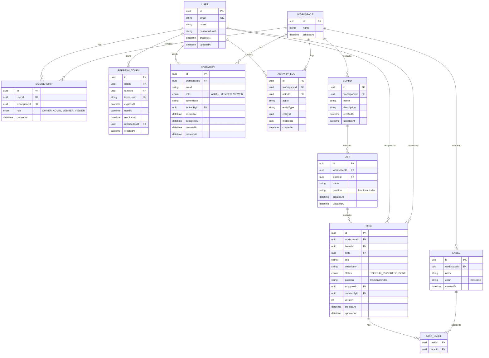

# Phase 0: Design & Architecture

This document outlines the system design for the real-time collaborative workspace with RBAC.

## Entity-Relationship Diagram



## Authorization Pipeline

Every workspace-scoped request follows:

```
1. Authenticate (verify JWT)
   ↓
2. Load Membership (workspaceId from DB)
   ├─ Not found → 404 NOT_FOUND (no existence leak)
   ├─ Found → continue
   ↓
3. Require Permission (action check against role)
   ├─ Insufficient role → 403 FORBIDDEN
   ├─ Granted → continue
   ↓
4. Target-aware Rules (complex role logic)
   ├─ Failed → 403 FORBIDDEN
   ├─ Passed → continue
   ↓
5. Service Layer (includes workspaceId in all queries)
   └─ No tenant-owned row by ID alone; always include workspaceId
```

## Permission Matrix

| Action | OWNER | ADMIN | MEMBER | VIEWER |
|--------|:-----:|:-----:|:------:|:------:|
| workspace:read | ✔ | ✔ | ✔ | ✔ |
| member:list | ✔ | ✔ | ✔ | ✔ |
| board:read | ✔ | ✔ | ✔ | ✔ |
| task:read | ✔ | ✔ | ✔ | ✔ |
| label:read | ✔ | ✔ | ✔ | ✔ |
| activity:read | ✔ | ✔ | ✔ | ✔ |
| dashboard:read | ✔ | ✔ | ✔ | ✔ |
| task:create | ✔ | ✔ | ✔ | ✘ |
| task:update | ✔ | ✔ | ✔ | ✘ |
| task:move | ✔ | ✔ | ✔ | ✘ |
| task:delete | ✔ | ✔ | ✔ | ✘ |
| list:create | ✔ | ✔ | ✔ | ✘ |
| list:update | ✔ | ✔ | ✔ | ✘ |
| list:move | ✔ | ✔ | ✔ | ✘ |
| list:delete | ✔ | ✔ | ✘ | ✘ |
| board:create | ✔ | ✔ | ✘ | ✘ |
| board:update | ✔ | ✔ | ✘ | ✘ |
| board:delete | ✔ | ✔ | ✘ | ✘ |
| label:create | ✔ | ✔ | ✔ | ✘ |
| label:update | ✔ | ✔ | ✘ | ✘ |
| label:delete | ✔ | ✔ | ✘ | ✘ |
| invitation:create | ✔ | ✔ | ✘ | ✘ |
| invitation:list | ✔ | ✔ | ✘ | ✘ |
| invitation:revoke | ✔ | ✔ | ✘ | ✘ |
| member:remove | ✔ | ✔ | ✘ | ✘ |
| member:changeRole | ✔ | ✔ | ✘ | ✘ |

## Ordering & Concurrency Design

### Fractional Indexing

- Positions use fractional-index algorithm (npm: `fractional-indexing`)
- Positions are byte-wise ordered (collation "C")
- Client provides `afterId` (anchor), server computes position
- No positions sent by client; prevents merge conflicts

### Transaction-based Locking

1. Lock target list/board row: `FOR UPDATE`
2. Resolve predecessor and successor tasks
3. Generate key between: `generateKeyBetween(pred, succ)`
4. Update position and version in single statement
5. Create activity log in same transaction
6. Emit realtime events after transaction commits

### Optimistic Locking for Edits

- `version` increments on every change
- `PATCH` requires `expectedVersion`
- Stale update → 409 VERSION_CONFLICT with current DTO
- Frontend auto-rebases if fields unchanged

## Real-Time Design

### Socket.IO Integration

- Shared Express HTTP server
- Transports: WebSocket only (no long-polling)
- Auth middleware verifies JWT on every connect
- Rooms: `workspace:{id}`, `board:{id}`, `user:{userId}`

### Event Emission

- All mutations go through REST API only
- Events emitted **after transaction commits**
- Payloads: `{ workspaceId, boardId?, actorId, data, emittedAt }`
- Clients apply events if version > cached version

### Member Removal & Role Changes

- Remove member: kick all their sockets from workspace rooms
- Role change: user sees restrictions on next action
- Immediate effect (no polling required)

## Token Design

### Access Token (JWT)

- Algorithm: HS256
- TTL: 15 minutes
- Claims: `sub`, `iat`, `exp`, `iss`, `aud`
- Storage: in-memory only (never localStorage)
- No roles in token

### Refresh Token (Opaque + Rotation)

- Opaque random 32 bytes base64url encoded
- Stored in secure httpOnly cookie
- Hashed in DB (sha256 hex)
- Family-based reuse detection:
  - Reuse within grace window (5 minutes) → returns REFRESH_RETRY
  - Reuse after grace window → revoke entire family
  - Token never reused, new token always issued

## Caching Design

### Dashboard Cache

- Key: `dashboard:{workspaceId}:{versionHash}`
- TTL: 5 minutes
- Invalidation: on board/list/task/member mutations
- Graceful fallback: DB read if Redis unavailable

### Redis Architecture

- Separate pub/sub connections for Socket.IO adapter
- Connection pooling with timeout handling
- Graceful degradation on connection loss

## Background Queue Design

### Invitations Email Job

- Queue: BullMQ with Redis backend
- Job type: `send-invitation-email`
- Retry: exponential backoff (3 attempts)
- Payload: invitation ID, recipient email, workspace name
- Response: returns 201 before job processes

### Worker

- Separate process from HTTP server
- Graceful shutdown: completes current jobs before exit
- Failure handling: logs, retries, dead-letter queue

## Error Handling

### Error Codes

- 400 VALIDATION_ERROR
- 401 UNAUTHENTICATED, TOKEN_EXPIRED, INVALID_CREDENTIALS
- 403 FORBIDDEN, INVITATION_EMAIL_MISMATCH
- 404 NOT_FOUND
- 409 VERSION_CONFLICT, STALE_REFERENCE, CONFLICT
- 503 SERVICE_UNAVAILABLE
- 500 INTERNAL (no stack trace in production)

### Request Tracing

- Unique request ID generated per request
- Included in all logs and error responses
- Facilitates debugging

## Failure Modes & Mitigation

| Failure | Detection | Mitigation |
|---------|-----------|-----------|
| DB down | Connection error | Return 503, graceful shutdown |
| Redis down | Connection timeout | Use DB, log warning, continue |
| Email job fails | BullMQ retry exhaustion | Dead-letter queue, admin alert |
| Concurrent moves | Duplicate position | Retry transaction (P2002 → 409) |
| Member removal race | Stale activity log | Activity references deleted user via actorId FK (SetNull) |
| Websocket reconnect miss | Client reconnects | Auto-rejoin rooms, refetch active board |
| Conflicting edit | Version mismatch | 409 with current DTO, frontend rebase |

---

**Last Updated:** Phase 0  
**Status:** Design approved, ready for Phase 1
